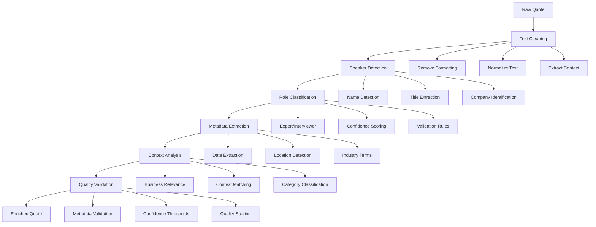

# FlexXray Quote Enrichment System

## Overview

The quote enrichment system enhances raw quotes with metadata, speaker information, and business context to improve analysis quality and relevance. This system is fully integrated with the current streamlined analysis workflow.

## Current System Integration

The quote enrichment system works seamlessly with:
- **`streamlined_quote_analysis.py`**: Core analysis engine
- **`robust_metadata_filtering.py`**: Speaker role detection and validation
- **`quote_processing.py`**: Quote processing pipeline
- **`quote_ranking.py`**: Intelligent quote selection

## Key Features

### 1. **Metadata Enrichment**
- Speaker name and role identification
- Company and title extraction
- Date and context information
- Confidence scoring for metadata accuracy

### 2. **Speaker Role Detection**
- Expert vs. interviewer classification
- Confidence-based filtering
- Automatic metadata correction
- Robust validation algorithms

### 3. **Business Context Enhancement**
- Industry-specific terminology recognition
- Business category classification
- Relevance scoring for business insights
- Context-aware quote filtering

## Enrichment Workflow



## Implementation

### Core Components

#### **Quote Processing** (`quote_processing.py`)
```python
from quote_processing import QuoteProcessor

# Initialize processor
processor = QuoteProcessor()

# Enrich quotes
enriched_quotes = processor.enrich_quotes_for_export(quotes)

# Get enrichment statistics
stats = processor.get_enrichment_statistics()
print(f"Enriched {stats['total_quotes']} quotes")
print(f"Metadata accuracy: {stats['metadata_accuracy']:.1f}%")
```

#### **Metadata Filtering** (`robust_metadata_filtering.py`)
```python
from robust_metadata_filtering import RobustMetadataFilter

# Initialize filter with confidence threshold
filter = RobustMetadataFilter(confidence_threshold=2)

# Filter and validate quotes
filtered_quotes = filter.filter_quotes_by_role(quotes, role="expert")

# Get filtering statistics
stats = filter.get_filtering_statistics()
print(f"Expert quotes: {stats['expert_count']}")
print(f"Interviewer quotes: {stats['interviewer_count']}")
```

#### **Quote Ranking** (`quote_ranking.py`)
```python
from quote_ranking import QuoteRanker

# Initialize ranker
ranker = QuoteRanker()

# Rank quotes by relevance
ranked_quotes = ranker.rank_quotes_by_relevance(
    quotes=enriched_quotes,
    question="market_leadership"
)

# Get ranking statistics
stats = ranker.get_ranking_statistics()
print(f"Top quotes: {len(stats['top_quotes'])}")
print(f"Average relevance: {stats['average_relevance']:.2f}")
```

## Configuration

### Environment Variables
```bash
# Required
OPENAI_API_KEY=your_api_key_here

# Optional
CONFIDENCE_THRESHOLD=2
METADATA_VALIDATION=True
ENABLE_CONTEXT_ANALYSIS=True
LOG_ENRICHMENT_PROGRESS=True
```

### Enrichment Settings
```python
# Configure enrichment parameters
enrichment_config = {
    "confidence_threshold": 2,        # Minimum confidence for metadata
    "enable_context_analysis": True,  # Business context enhancement
    "metadata_validation": True,      # Validate extracted metadata
    "speaker_detection": True,        # Enable speaker role detection
    "company_extraction": True,       # Extract company information
    "title_extraction": True,         # Extract job titles
    "date_extraction": True,          # Extract dates and timing
    "industry_terms": True            # Industry-specific terminology
}
```

## Usage Examples

### Basic Enrichment
```python
from streamlined_quote_analysis import StreamlinedQuoteAnalysis

# Initialize the system
analyzer = StreamlinedQuoteAnalysis(api_key="your_key")

# Analyze transcripts (includes enrichment)
results = analyzer.analyze_transcripts("FlexXray Transcripts/")

# Access enriched quotes
enriched_quotes = results.get("quotes", [])
for quote in enriched_quotes:
    print(f"Speaker: {quote.get('speaker', 'Unknown')}")
    print(f"Role: {quote.get('role', 'Unknown')}")
    print(f"Confidence: {quote.get('confidence', 0):.2f}")
    print(f"Text: {quote.get('text', '')[:100]}...")
    print("---")
```

### Advanced Enrichment
```python
# Custom enrichment pipeline
def custom_enrichment_pipeline(quotes):
    from quote_processing import QuoteProcessor
    from robust_metadata_filtering import RobustMetadataFilter
    
    # Initialize components
    processor = QuoteProcessor()
    filter = RobustMetadataFilter(confidence_threshold=3)
    
    # Process quotes
    enriched = processor.enrich_quotes_for_export(quotes)
    
    # Filter by role and confidence
    filtered = filter.filter_quotes_by_role(enriched, role="expert")
    high_confidence = [q for q in filtered if q.get('confidence', 0) >= 4]
    
    return high_confidence

# Use custom pipeline
high_quality_quotes = custom_enrichment_pipeline(quotes)
```

### Batch Enrichment
```python
from batch_manager import BatchManager

# Initialize batch manager
batch_manager = BatchManager()

# Process quotes in batches with enrichment
enriched_results = batch_manager.process_quotes_batch(
    quotes=quotes,
    enrichment_function=custom_enrichment_pipeline,
    batch_size=20
)
```

## Quality Metrics

### Metadata Accuracy
```python
# Calculate metadata accuracy
def calculate_metadata_accuracy(quotes):
    total = len(quotes)
    accurate = sum(1 for q in quotes if q.get('confidence', 0) >= 3)
    return (accurate / total) * 100 if total > 0 else 0

# Get accuracy statistics
accuracy = calculate_metadata_accuracy(enriched_quotes)
print(f"Metadata accuracy: {accuracy:.1f}%")
```

### Speaker Role Distribution
```python
# Analyze speaker role distribution
def analyze_speaker_roles(quotes):
    roles = {}
    for quote in quotes:
        role = quote.get('role', 'unknown')
        roles[role] = roles.get(role, 0) + 1
    
    return roles

# Get role distribution
role_distribution = analyze_speaker_roles(enriched_quotes)
for role, count in role_distribution.items():
    print(f"{role}: {count} quotes")
```

### Business Relevance Scoring
```python
# Calculate business relevance
def calculate_business_relevance(quotes):
    relevant = sum(1 for q in quotes if q.get('business_relevance', 0) >= 0.7)
    total = len(quotes)
    return (relevant / total) * 100 if total > 0 else 0

# Get relevance score
relevance = calculate_business_relevance(enriched_quotes)
print(f"Business relevance: {relevance:.1f}%")
```

## Integration with Analysis

### Question-Based Analysis
```python
# Enrich quotes for specific business questions
def enrich_for_questions(quotes, questions):
    enriched_quotes = []
    
    for quote in quotes:
        # Basic enrichment
        enriched_quote = enrich_quote_basic(quote)
        
        # Question-specific enrichment
        enriched_quote['question_relevance'] = {}
        for question in questions:
            relevance = calculate_question_relevance(quote, question)
            enriched_quote['question_relevance'][question] = relevance
        
        enriched_quotes.append(enriched_quote)
    
    return enriched_quotes

# Use in streamlined analysis
questions = ["market_leadership", "value_proposition", "local_presence"]
question_enriched_quotes = enrich_for_questions(quotes, questions)
```

### Export Integration
```python
# Prepare enriched quotes for export
def prepare_for_export(enriched_quotes):
    export_data = []
    
    for quote in enriched_quotes:
        export_quote = {
            'text': quote.get('text', ''),
            'speaker': quote.get('speaker', 'Unknown'),
            'role': quote.get('role', 'Unknown'),
            'confidence': quote.get('confidence', 0),
            'company': quote.get('company', ''),
            'title': quote.get('title', ''),
            'date': quote.get('date', ''),
            'business_relevance': quote.get('business_relevance', 0),
            'question_relevance': quote.get('question_relevance', {})
        }
        export_data.append(export_quote)
    
    return export_data

# Use in export workflow
export_ready_quotes = prepare_for_export(enriched_quotes)
```

## Performance Optimization

### Caching Strategies
```python
# Implement quote enrichment caching
import hashlib
import json

def cache_enriched_quote(quote, cache_dir="cache"):
    # Create cache key
    quote_hash = hashlib.md5(quote['text'].encode()).hexdigest()
    cache_file = f"{cache_dir}/enriched_{quote_hash}.json"
    
    # Save enriched quote
    with open(cache_file, 'w') as f:
        json.dump(quote, f, indent=2)
    
    return cache_file

def load_cached_enrichment(quote_text, cache_dir="cache"):
    # Check for cached enrichment
    quote_hash = hashlib.md5(quote_text.encode()).hexdigest()
    cache_file = f"{cache_dir}/enriched_{quote_hash}.json"
    
    if os.path.exists(cache_file):
        with open(cache_file, 'r') as f:
            return json.load(f)
    
    return None
```

### Batch Processing
```python
# Process quotes in optimized batches
def process_enrichment_batches(quotes, batch_size=20):
    enriched_quotes = []
    
    for i in range(0, len(quotes), batch_size):
        batch = quotes[i:i + batch_size]
        
        # Process batch
        enriched_batch = enrich_quotes_batch(batch)
        enriched_quotes.extend(enriched_batch)
        
        # Progress update
        progress = (i + len(batch)) / len(quotes) * 100
        print(f"Enrichment progress: {progress:.1f}%")
    
    return enriched_quotes
```

## Error Handling

### Common Issues and Solutions

#### **Metadata Extraction Failures**
```python
# Handle metadata extraction errors
def safe_metadata_extraction(quote):
    try:
        return extract_metadata(quote)
    except Exception as e:
        logger.warning(f"Metadata extraction failed: {e}")
        return {
            'speaker': 'Unknown',
            'role': 'unknown',
            'confidence': 0,
            'company': '',
            'title': ''
        }
```

#### **Speaker Role Detection Issues**
```python
# Fallback for speaker role detection
def robust_speaker_detection(quote):
    # Try primary detection method
    try:
        return detect_speaker_role(quote)
    except Exception as e:
        logger.warning(f"Primary speaker detection failed: {e}")
        
        # Fallback to simple heuristics
        return fallback_speaker_detection(quote)
```

#### **Context Analysis Failures**
```python
# Handle context analysis errors
def safe_context_analysis(quote):
    try:
        return analyze_business_context(quote)
    except Exception as e:
        logger.warning(f"Context analysis failed: {e}")
        return {
            'business_relevance': 0.5,
            'industry_terms': [],
            'category': 'general'
        }
```

## Testing and Validation

### Enrichment Tests
```bash
# Run enrichment-specific tests
python -m pytest tests/test_quote_enrichment.py -v

# Test metadata filtering
python -m pytest tests/test_robust_metadata_filtering.py -v

# Test quote processing
python -m pytest tests/test_quote_processing.py -v
```

### Quality Validation
```python
# Validate enrichment quality
def validate_enrichment_quality(enriched_quotes):
    validation_results = {
        'total_quotes': len(enriched_quotes),
        'metadata_complete': 0,
        'high_confidence': 0,
        'role_identified': 0,
        'business_relevant': 0
    }
    
    for quote in enriched_quotes:
        # Check metadata completeness
        if all(key in quote for key in ['speaker', 'role', 'confidence']):
            validation_results['metadata_complete'] += 1
        
        # Check confidence levels
        if quote.get('confidence', 0) >= 3:
            validation_results['high_confidence'] += 1
        
        # Check role identification
        if quote.get('role') in ['expert', 'interviewer']:
            validation_results['role_identified'] += 1
        
        # Check business relevance
        if quote.get('business_relevance', 0) >= 0.7:
            validation_results['business_relevant'] += 1
    
    return validation_results
```

## Future Enhancements

### Planned Improvements
1. **AI-Powered Metadata Extraction**: Machine learning for better speaker identification
2. **Multi-language Support**: Extend enrichment to other languages
3. **Advanced Context Analysis**: Industry-specific business context recognition
4. **Real-time Enrichment**: Live enrichment during transcript processing
5. **Custom Enrichment Rules**: User-defined enrichment patterns

### Integration Opportunities
- **Cloud-based Enrichment**: Scalable enrichment services
- **Advanced Analytics**: Enrichment quality analytics and optimization
- **Third-party Data**: Integration with external business databases
- **Custom Models**: Company-specific enrichment models

---

**The quote enrichment system is fully integrated with the current streamlined analysis workflow, providing high-quality metadata and business context for improved analysis results.**
