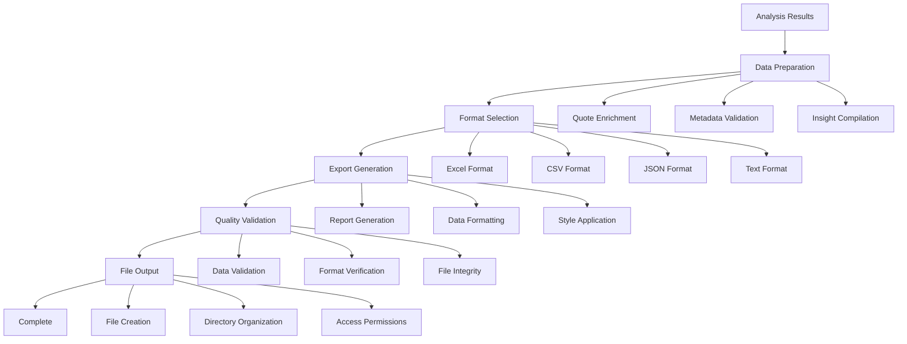

# FlexXray Quote Export System

## Overview

The quote export system generates professional reports and exports from analyzed quotes, providing multiple output formats and comprehensive data presentation. This system is fully integrated with the current streamlined analysis workflow.

## Current System Integration

The quote export system works seamlessly with:
- **`streamlined_quote_analysis.py`**: Core analysis engine
- **`export_utils.py`**: Export functionality and utilities
- **`quote_processing.py`**: Quote processing pipeline
- **`summary_generation.py`**: Summary and report generation

## Key Features

### 1. **Multiple Export Formats**
- Excel (.xlsx) with professional formatting
- CSV for data analysis
- JSON for API integration
- Text summaries for quick review

### 2. **Professional Excel Reports**
- Company summary with key insights
- Detailed quote analysis with metadata
- Confidence scores and validation metrics
- Performance statistics and cost analysis

### 3. **Comprehensive Data Export**
- All 7 business insights with quotes
- Speaker information and role validation
- Question-specific relevance scores
- Processing metadata and timestamps

## Export Workflow



## Implementation

### Core Components

#### **Export Manager** (`export_utils.py`)
```python
from export_utils import ExportManager

# Initialize export manager
export_manager = ExportManager()

# Export to Excel
excel_file = export_manager.export_to_excel(
    results=analysis_results,
    output_dir="Outputs/",
    filename="flexxray_analysis_results.xlsx"
)

# Export to CSV
csv_file = export_manager.export_to_csv(
    results=analysis_results,
    output_dir="Outputs/",
    filename="flexxray_analysis_results.csv"
)
```

#### **Summary Generator** (`summary_generation.py`)
```python
from summary_generation import SummaryGenerator

# Initialize summary generator
summary_generator = SummaryGenerator()

# Generate company summary
company_summary = summary_generator.generate_company_summary(
    quotes=enriched_quotes,
    insights=business_insights
)

# Generate detailed report
detailed_report = summary_generator.generate_detailed_report(
    analysis_results=results,
    include_metadata=True,
    include_performance=True
)
```

#### **Quote Processing** (`quote_processing.py`)
```python
from quote_processing import QuoteProcessor

# Initialize processor
processor = QuoteProcessor()

# Prepare quotes for export
export_ready_quotes = processor.prepare_quotes_for_export(
    quotes=enriched_quotes,
    include_metadata=True,
    include_confidence=True
)
```

## Export Formats

### Excel Export (.xlsx)

#### **Company Summary Sheet**
```python
# Excel export configuration
excel_config = {
    "company_summary": {
        "sheet_name": "Company Summary",
        "include_insights": True,
        "include_quotes": True,
        "include_metadata": True
    },
    "quote_analysis": {
        "sheet_name": "Quote Analysis",
        "include_speaker": True,
        "include_role": True,
        "include_confidence": True,
        "include_relevance": True
    },
    "performance_metrics": {
        "sheet_name": "Performance Metrics",
        "include_timing": True,
        "include_costs": True,
        "include_statistics": True
    }
}
```

#### **Quote Analysis Sheet**
- **Quote Text**: Full quote content
- **Speaker**: Speaker name and title
- **Role**: Expert or interviewer classification
- **Confidence**: Metadata confidence score
- **Relevance**: Question-specific relevance scores
- **Questions**: Applicable business questions
- **Context**: Business context and category

#### **Performance Metrics Sheet**
- **Processing Time**: Total analysis duration
- **API Costs**: OpenAI API usage costs
- **Quote Statistics**: Total quotes, expert quotes, interviewer quotes
- **Quality Metrics**: Confidence scores, relevance scores
- **System Performance**: Memory usage, processing efficiency

### CSV Export (.csv)

#### **Structured Data Export**
```python
# CSV export configuration
csv_config = {
    "include_headers": True,
    "field_separator": ",",
    "text_qualifier": '"',
    "encoding": "utf-8",
    "date_format": "%Y-%m-%d %H:%M:%S"
}

# Export quotes to CSV
csv_data = export_manager.export_quotes_to_csv(
    quotes=enriched_quotes,
    config=csv_config,
    output_file="quotes_export.csv"
)
```

#### **CSV Fields**
- `quote_id`: Unique quote identifier
- `text`: Quote text content
- `speaker`: Speaker name
- `role`: Speaker role (expert/interviewer)
- `confidence`: Metadata confidence score
- `company`: Company name
- `title`: Job title
- `date`: Quote date/timestamp
- `market_leadership`: Relevance to market leadership
- `value_proposition`: Relevance to value proposition
- `local_presence`: Relevance to local presence
- `technology_advantages`: Relevance to technology
- `rapid_turnaround`: Relevance to turnaround time
- `limited_tam`: Relevance to TAM limitations
- `unpredictable_timing`: Relevance to timing issues

### JSON Export (.json)

#### **Structured Data Export**
```python
# JSON export configuration
json_config = {
    "indent": 2,
    "ensure_ascii": False,
    "default": str,
    "include_metadata": True
}

# Export to JSON
json_data = export_manager.export_to_json(
    results=analysis_results,
    config=json_config,
    output_file="analysis_results.json"
)
```

#### **JSON Structure**
```json
{
  "company_summary": {
    "market_leadership": {
      "insight": "Insight text with quote citations",
      "quotes": ["quote_id_1", "quote_id_2"],
      "confidence": 0.95
    },
    "value_proposition": {
      "insight": "Insight text with quote citations",
      "quotes": ["quote_id_3", "quote_id_4"],
      "confidence": 0.92
    }
  },
  "quotes": [
    {
      "id": "quote_id_1",
      "text": "Quote text content",
      "speaker": "Speaker Name",
      "role": "expert",
      "confidence": 0.95,
      "relevance_scores": {
        "market_leadership": 0.89,
        "value_proposition": 0.76
      }
    }
  ],
  "metadata": {
    "processing_time": "2.5 minutes",
    "api_cost": "$0.45",
    "total_quotes": 150,
    "expert_quotes": 120
  }
}
```

### Text Export (.txt)

#### **Human-Readable Summary**
```python
# Text export configuration
text_config = {
    "include_insights": True,
    "include_quotes": True,
    "include_metadata": True,
    "format": "structured"
}

# Export to text
text_report = export_manager.export_to_text(
    results=analysis_results,
    config=text_config,
    output_file="analysis_summary.txt"
)
```

#### **Text Format Example**
```
FLEXXRAY TRANSCRIPT ANALYSIS SUMMARY
====================================

COMPANY INSIGHTS
----------------

1. MARKET LEADERSHIP
   Insight: FlexXray demonstrates strong market leadership through...
   Supporting Quotes:
   - "We're the clear market leader in foreign material detection..."
   - "Our technology gives us a 3-5 year advantage over competitors..."

2. VALUE PROPOSITION
   Insight: FlexXray's value proposition effectively addresses...
   Supporting Quotes:
   - "The risk of insourcing is simply too high for most companies..."
   - "Our technology makes it economically viable to outsource..."

PERFORMANCE METRICS
-------------------
- Total Processing Time: 2.5 minutes
- API Cost: $0.45
- Total Quotes Analyzed: 150
- Expert Quotes: 120 (80%)
- Interviewer Quotes: 30 (20%)
```

## Configuration

### Environment Variables
```bash
# Required
OPENAI_API_KEY=your_api_key_here

# Optional
OUTPUT_DIR=Outputs
EXPORT_FORMAT=excel
INCLUDE_METADATA=True
INCLUDE_PERFORMANCE=True
```

### Export Settings
```python
# Configure export options
export_config = {
    "formats": ["excel", "csv", "json"],  # Export formats
    "output_directory": "Outputs/",       # Output directory
    "filename_prefix": "flexxray_",       # Filename prefix
    "include_metadata": True,             # Include metadata
    "include_performance": True,          # Include performance metrics
    "excel_formatting": True,             # Professional Excel formatting
    "csv_encoding": "utf-8",             # CSV encoding
    "json_indent": 2,                    # JSON formatting
    "overwrite_existing": False          # Overwrite existing files
}
```

## Usage Examples

### Basic Export
```python
from streamlined_quote_analysis import StreamlinedQuoteAnalysis

# Initialize the system
analyzer = StreamlinedQuoteAnalysis(api_key="your_key")

# Run analysis (includes export)
results = analyzer.analyze_transcripts("FlexXray Transcripts/")

# Check outputs
import os
output_files = os.listdir("Outputs/")
print(f"Generated files: {output_files}")
```

### Custom Export
```python
from export_utils import ExportManager

# Initialize export manager
export_manager = ExportManager()

# Custom export configuration
custom_config = {
    "formats": ["excel"],
    "output_directory": "Custom_Outputs/",
    "filename_prefix": "custom_analysis_",
    "include_metadata": True,
    "include_performance": True,
    "excel_formatting": True
}

# Export with custom configuration
export_files = export_manager.export_results(
    results=analysis_results,
    config=custom_config
)

print(f"Exported to: {export_files}")
```

### Batch Export
```python
# Export multiple analysis results
def batch_export(analysis_results_list, output_dir="Batch_Outputs/"):
    export_manager = ExportManager()
    exported_files = []
    
    for i, results in enumerate(analysis_results_list):
        filename = f"batch_analysis_{i+1}"
        
        files = export_manager.export_results(
            results=results,
            output_directory=output_dir,
            filename_prefix=filename
        )
        
        exported_files.extend(files)
    
    return exported_files

# Use batch export
batch_files = batch_export([results1, results2, results3])
print(f"Batch exported {len(batch_files)} files")
```

## Quality Control

### Data Validation
```python
# Validate export data
def validate_export_data(results):
    validation_errors = []
    
    # Check required fields
    required_fields = ['company_summary', 'quotes', 'metadata']
    for field in required_fields:
        if field not in results:
            validation_errors.append(f"Missing required field: {field}")
    
    # Check quote structure
    if 'quotes' in results:
        for i, quote in enumerate(results['quotes']):
            quote_fields = ['text', 'speaker', 'role']
            for field in quote_fields:
                if field not in quote:
                    validation_errors.append(f"Quote {i} missing field: {field}")
    
    return validation_errors

# Validate before export
errors = validate_export_data(analysis_results)
if errors:
    print(f"Validation errors: {errors}")
    # Handle errors before export
else:
    # Proceed with export
    export_results(analysis_results)
```

### Format Verification
```python
# Verify export file integrity
def verify_export_file(file_path, expected_format):
    import os
    
    if not os.path.exists(file_path):
        return False, "File does not exist"
    
    file_size = os.path.getsize(file_path)
    if file_size == 0:
        return False, "File is empty"
    
    # Format-specific verification
    if expected_format == "excel":
        try:
            import openpyxl
            workbook = openpyxl.load_workbook(file_path)
            return True, f"Excel file verified, {len(workbook.sheets)} sheets"
        except Exception as e:
            return False, f"Excel verification failed: {e}"
    
    elif expected_format == "csv":
        try:
            with open(file_path, 'r', encoding='utf-8') as f:
                lines = f.readlines()
                return True, f"CSV file verified, {len(lines)} lines"
        except Exception as e:
            return False, f"CSV verification failed: {e}"
    
    return True, "File verified"

# Verify exported files
for file_path in exported_files:
    format_type = file_path.split('.')[-1]
    is_valid, message = verify_export_file(file_path, format_type)
    print(f"{file_path}: {message}")
```

## Performance Optimization

### Export Optimization
```python
# Optimize export performance
def optimize_export_config(results_size):
    if results_size < 100:
        return {
            "batch_size": 50,
            "parallel_processing": False,
            "memory_optimization": False
        }
    elif results_size < 500:
        return {
            "batch_size": 100,
            "parallel_processing": True,
            "memory_optimization": True
        }
    else:
        return {
            "batch_size": 200,
            "parallel_processing": True,
            "memory_optimization": True,
            "streaming_export": True
        }

# Use optimized configuration
config = optimize_export_config(len(analysis_results['quotes']))
export_manager.export_results(analysis_results, config=config)
```

### Memory Management
```python
# Memory-efficient export for large datasets
def memory_efficient_export(results, output_file):
    import json
    
    with open(output_file, 'w') as f:
        f.write('{\n')
        
        # Write company summary
        f.write('  "company_summary": ')
        json.dump(results['company_summary'], f, indent=2)
        f.write(',\n')
        
        # Write quotes in streaming fashion
        f.write('  "quotes": [\n')
        for i, quote in enumerate(results['quotes']):
            if i > 0:
                f.write(',\n')
            json.dump(quote, f, indent=4)
        f.write('\n  ],\n')
        
        # Write metadata
        f.write('  "metadata": ')
        json.dump(results['metadata'], f, indent=2)
        f.write('\n}')
    
    return output_file
```

## Error Handling

### Common Export Issues

#### **File Permission Errors**
```python
# Handle file permission issues
def safe_export(results, output_path):
    try:
        return export_manager.export_results(results, output_path)
    except PermissionError:
        # Try alternative directory
        alt_path = f"/tmp/{os.path.basename(output_path)}"
        logger.warning(f"Permission denied, using alternative path: {alt_path}")
        return export_manager.export_results(results, alt_path)
    except Exception as e:
        logger.error(f"Export failed: {e}")
        raise
```

#### **Disk Space Issues**
```python
# Check disk space before export
def check_disk_space(directory, required_mb=100):
    import shutil
    
    total, used, free = shutil.disk_usage(directory)
    free_mb = free // (1024 * 1024)
    
    if free_mb < required_mb:
        raise RuntimeError(f"Insufficient disk space: {free_mb}MB available, {required_mb}MB required")
    
    return free_mb

# Check before export
available_space = check_disk_space("Outputs/", required_mb=50)
print(f"Available space: {available_space}MB")
```

#### **Format Compatibility Issues**
```python
# Handle format compatibility
def ensure_format_compatibility(results, format_type):
    if format_type == "excel":
        # Ensure Excel compatibility
        for quote in results.get('quotes', []):
            # Truncate long text fields
            if len(quote.get('text', '')) > 32000:
                quote['text'] = quote['text'][:32000] + "..."
    
    elif format_type == "csv":
        # Ensure CSV compatibility
        for quote in results.get('quotes', []):
            # Escape special characters
            quote['text'] = quote['text'].replace('"', '""')
    
    return results

# Ensure compatibility before export
compatible_results = ensure_format_compatibility(analysis_results, "excel")
export_manager.export_results(compatible_results, format="excel")
```

## Integration with Current System

### Workflow Integration
```python
# Integrate with streamlined analysis workflow
def complete_analysis_workflow(transcript_directory):
    # Run analysis
    analyzer = StreamlinedQuoteAnalysis(api_key="your_key")
    results = analyzer.analyze_transcripts(transcript_directory)
    
    # Export results
    export_manager = ExportManager()
    export_files = export_manager.export_results(
        results=results,
        formats=["excel", "csv"],
        output_directory="Outputs/"
    )
    
    return results, export_files

# Use complete workflow
analysis_results, exported_files = complete_analysis_workflow("FlexXray Transcripts/")
print(f"Analysis complete. Exported to: {exported_files}")
```

### Company Configuration Integration
```python
# Use company-specific export settings
from company_config import get_company_config

def company_specific_export(company_name, results):
    config = get_company_config(company_name)
    
    export_config = {
        "formats": config.get("export_formats", ["excel"]),
        "output_directory": f"Outputs/{company_name}/",
        "filename_prefix": f"{company_name.lower()}_",
        "include_metadata": config.get("include_metadata", True),
        "include_performance": config.get("include_performance", True)
    }
    
    export_manager = ExportManager()
    return export_manager.export_results(results, config=export_config)

# Use company-specific export
exported_files = company_specific_export("FlexXray", analysis_results)
```

## Testing and Validation

### Export Tests
```bash
# Run export-specific tests
python -m pytest tests/test_quote_export.py -v

# Test export utilities
python -m pytest tests/test_export_utils.py -v

# Test summary generation
python -m pytest tests/test_summary_generation.py -v
```

### Export Validation
```python
# Validate export functionality
def validate_export_functionality():
    # Test data
    test_results = {
        "company_summary": {
            "market_leadership": "Test insight"
        },
        "quotes": [
            {
                "text": "Test quote",
                "speaker": "Test Speaker",
                "role": "expert"
            }
        ],
        "metadata": {
            "processing_time": "1 minute"
        }
    }
    
    # Test export
    export_manager = ExportManager()
    export_files = export_manager.export_results(
        results=test_results,
        formats=["excel", "csv", "json"],
        output_directory="test_outputs/"
    )
    
    # Verify files
    for file_path in export_files:
        is_valid, message = verify_export_file(file_path, file_path.split('.')[-1])
        print(f"{file_path}: {message}")
    
    return len(export_files) == 3

# Run validation
if validate_export_functionality():
    print("Export functionality validated successfully")
else:
    print("Export validation failed")
```

## Future Enhancements

### Planned Improvements
1. **Advanced Excel Formatting**: Custom templates and branding
2. **Interactive Reports**: HTML-based interactive reports
3. **Real-time Export**: Live export during analysis
4. **Cloud Integration**: Direct export to cloud storage
5. **Custom Export Formats**: User-defined export formats

### Integration Opportunities
- **Business Intelligence Tools**: Integration with BI platforms
- **Document Management**: Integration with document systems
- **Reporting Platforms**: Integration with reporting tools
- **Data Analytics**: Integration with analytics platforms

---

**The quote export system is fully integrated with the current streamlined analysis workflow, providing professional and comprehensive export capabilities for all analysis results.**
