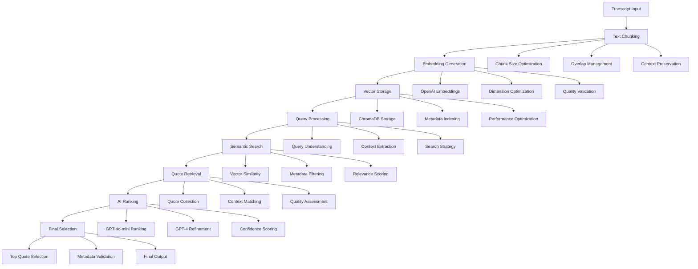

# FlexXray RAG Functionality Guide

## Overview

The Retrieval-Augmented Generation (RAG) system in FlexXray provides semantic search capabilities using vector databases and AI-powered quote retrieval. This system is fully integrated with the current streamlined analysis workflow.

## Current System Integration

The RAG system works seamlessly with:
- **`streamlined_quote_analysis.py`**: Core analysis engine
- **`vector_database.py`**: ChromaDB integration and management
- **`quote_ranking.py`**: Intelligent quote selection
- **`robust_metadata_filtering.py`**: Speaker role detection and validation

## Key Features

### 1. **Vector Database Integration**
- ChromaDB for efficient vector storage
- OpenAI embeddings for semantic search
- Metadata filtering and query optimization
- Real-time search and retrieval

### 2. **Semantic Search**
- Question-based quote retrieval
- Context-aware search algorithms
- Relevance scoring and ranking
- Multi-dimensional search capabilities

### 3. **AI-Powered Retrieval**
- Intelligent quote selection
- Hybrid ranking with GPT models
- Confidence-based filtering
- Business context understanding

## RAG Architecture



## Implementation

### Core Components

#### **Vector Database Manager** (`vector_database.py`)
```python
from vector_database import VectorDatabaseManager

# Initialize vector database
db_manager = VectorDatabaseManager()

# Store quotes with embeddings
db_manager.store_quotes_with_embeddings(quotes)

# Perform semantic search
search_results = db_manager.semantic_search_quotes(
    query="market leadership",
    n_results=20,
    filter_metadata={"role": "expert"}
)

# Get database statistics
stats = db_manager.get_database_statistics()
print(f"Total quotes: {stats['total_quotes']}")
print(f"Total embeddings: {stats['total_embeddings']}")
```

#### **Streamlined Quote Analysis** (`streamlined_quote_analysis.py`)
```python
from streamlined_quote_analysis import StreamlinedQuoteAnalysis

# Initialize the system
analyzer = StreamlinedQuoteAnalysis(api_key="your_key")

# Use RAG for quote retrieval
results = analyzer.analyze_transcripts("FlexXray Transcripts/")

# Access RAG-enhanced results
rag_quotes = results.get("quotes", [])
for quote in rag_quotes:
    print(f"Relevance: {quote.get('relevance_score', 0):.2f}")
    print(f"Context: {quote.get('business_context', '')}")
    print(f"Text: {quote.get('text', '')[:100]}...")
```

#### **Quote Ranking** (`quote_ranking.py`)
```python
from quote_ranking import QuoteRanker

# Initialize ranker
ranker = QuoteRanker()

# Rank quotes using RAG and AI
ranked_quotes = ranker.rank_quotes_with_rag(
    quotes=search_results,
    question="market_leadership",
    use_hybrid_ranking=True
)

# Get ranking statistics
stats = ranker.get_ranking_statistics()
print(f"RAG retrieval: {stats['rag_quotes']} quotes")
print(f"AI ranking: {stats['ai_ranked']} quotes")
```

## RAG Workflow

### 1. **Document Processing**
```python
# Process transcripts for RAG
def process_for_rag(transcript_directory):
    from document_processor import DocumentProcessor
    
    processor = DocumentProcessor()
    documents = processor.process_directory(transcript_directory)
    
    # Extract quotes and context
    quotes = []
    for doc in documents:
        doc_quotes = processor.extract_quotes(doc)
        quotes.extend(doc_quotes)
    
    return quotes

# Process transcripts
quotes = process_for_rag("FlexXray Transcripts/")
print(f"Extracted {len(quotes)} quotes for RAG")
```

### 2. **Embedding Generation**
```python
# Generate embeddings for quotes
def generate_embeddings(quotes, api_key):
    from openai import OpenAI
    
    client = OpenAI(api_key=api_key)
    embeddings = []
    
    for quote in quotes:
        response = client.embeddings.create(
            model="text-embedding-3-small",
            input=quote['text']
        )
        embeddings.append({
            'quote_id': quote['id'],
            'embedding': response.data[0].embedding,
            'metadata': quote['metadata']
        })
    
    return embeddings

# Generate embeddings
embeddings = generate_embeddings(quotes, api_key)
print(f"Generated {len(embeddings)} embeddings")
```

### 3. **Vector Storage**
```python
# Store embeddings in ChromaDB
def store_embeddings(embeddings, collection_name="flexxray_quotes"):
    import chromadb
    
    client = chromadb.PersistentClient(path="./chroma_db")
    collection = client.get_or_create_collection(collection_name)
    
    # Prepare data for storage
    ids = [emb['quote_id'] for emb in embeddings]
    texts = [emb['metadata']['text'] for emb in embeddings]
    embeddings_list = [emb['embedding'] for emb in embeddings]
    metadatas = [emb['metadata'] for emb in embeddings]
    
    # Store in collection
    collection.add(
        ids=ids,
        embeddings=embeddings_list,
        documents=texts,
        metadatas=metadatas
    )
    
    return collection

# Store embeddings
collection = store_embeddings(embeddings)
print(f"Stored {len(embeddings)} embeddings in ChromaDB")
```

### 4. **Semantic Search**
```python
# Perform semantic search
def semantic_search(query, collection, n_results=20, filter_metadata=None):
    # Generate query embedding
    query_embedding = generate_embeddings([{'text': query}], api_key)[0]['embedding']
    
    # Perform search
    results = collection.query(
        query_embeddings=[query_embedding],
        n_results=n_results,
        where=filter_metadata
    )
    
    return results

# Search for market leadership quotes
search_results = semantic_search(
    query="market leadership and competitive advantage",
    collection=collection,
    n_results=15,
    filter_metadata={"role": "expert"}
)

print(f"Found {len(search_results['ids'][0])} relevant quotes")
```

### 5. **AI-Powered Ranking**
```python
# Rank quotes using AI
def rank_quotes_with_ai(quotes, question, model="gpt-4o-mini"):
    from openai import OpenAI
    
    client = OpenAI(api_key=api_key)
    ranked_quotes = []
    
    for quote in quotes:
        # Create ranking prompt
        prompt = f"""
        Question: {question}
        
        Quote: {quote['text']}
        
        Rate this quote's relevance to the question on a scale of 1-10.
        Provide a brief explanation for your rating.
        
        Rating: [1-10]
        Explanation: [Brief explanation]
        """
        
        # Get AI ranking
        response = client.chat.completions.create(
            model=model,
            messages=[{"role": "user", "content": prompt}],
            max_tokens=100
        )
        
        # Parse response
        rating_text = response.choices[0].message.content
        # Extract rating and explanation (simplified)
        quote['ai_rating'] = rating_text
        ranked_quotes.append(quote)
    
    # Sort by AI rating
    ranked_quotes.sort(key=lambda x: x.get('ai_rating', 0), reverse=True)
    return ranked_quotes

# Rank quotes
ranked_quotes = rank_quotes_with_ai(
    search_results['ids'][0],
    question="What evidence shows FlexXray's market leadership?"
)

print(f"Ranked {len(ranked_quotes)} quotes using AI")
```

## Configuration

### Environment Variables
```bash
# Required
OPENAI_API_KEY=your_api_key_here

# Optional
CHROMA_DB_PATH=./chroma_db
EMBEDDING_MODEL=text-embedding-3-small
CHUNK_SIZE=1000
CHUNK_OVERLAP=200
```

### RAG Settings
```python
# Configure RAG parameters
rag_config = {
    "embedding_model": "text-embedding-3-small",
    "chunk_size": 1000,
    "chunk_overlap": 200,
    "max_results": 50,
    "similarity_threshold": 0.7,
    "enable_metadata_filtering": True,
    "enable_ai_ranking": True,
    "hybrid_ranking": True
}
```

### ChromaDB Configuration
```python
# ChromaDB settings
chroma_config = {
    "persist_directory": "./chroma_db",
    "anonymized_telemetry": False,
    "allow_reset": True,
    "collection_metadata": {
        "hnsw:space": "cosine",
        "hnsw:construction_ef": 100,
        "hnsw:search_ef": 50
    }
}
```

## Usage Examples

### Basic RAG Search
```python
from streamlined_quote_analysis import StreamlinedQuoteAnalysis

# Initialize the system
analyzer = StreamlinedQuoteAnalysis(api_key="your_key")

# Use RAG for analysis
results = analyzer.analyze_transcripts("FlexXray Transcripts/")

# Access RAG-enhanced insights
insights = results.get("company_summary", {})
for question, insight in insights.items():
    print(f"{question}: {insight}")
```

### Advanced RAG Search
```python
from vector_database import VectorDatabaseManager

# Initialize database manager
db_manager = VectorDatabaseManager()

# Custom search with filters
custom_results = db_manager.semantic_search_quotes(
    query="technology advantages and proprietary solutions",
    n_results=30,
    filter_metadata={
        "role": "expert",
        "confidence": {"$gte": 0.8},
        "company": "FlexXray"
    }
)

# Process results
for result in custom_results:
    print(f"Relevance: {result.get('similarity', 0):.3f}")
    print(f"Quote: {result.get('text', '')[:100]}...")
    print("---")
```

### RAG with Custom Questions
```python
# Define custom business questions
custom_questions = {
    "innovation_leadership": "How does FlexXray demonstrate innovation leadership?",
    "customer_satisfaction": "What evidence shows high customer satisfaction?",
    "growth_potential": "What factors indicate strong growth potential?",
    "competitive_moats": "What competitive advantages does FlexXray have?"
}

# Use RAG for custom analysis
def custom_rag_analysis(questions):
    db_manager = VectorDatabaseManager()
    results = {}
    
    for key, question in questions.items():
        # Search for relevant quotes
        quotes = db_manager.semantic_search_quotes(
            query=question,
            n_results=15,
            filter_metadata={"role": "expert"}
        )
        
        # Rank and select top quotes
        top_quotes = rank_quotes_with_ai(quotes, question)
        results[key] = {
            "question": question,
            "top_quotes": top_quotes[:5],
            "total_matches": len(quotes)
        }
    
    return results

# Run custom analysis
custom_results = custom_rag_analysis(custom_questions)
for key, result in custom_results.items():
    print(f"{key}: {result['total_matches']} matches, {len(result['top_quotes'])} top quotes")
```

## Performance Optimization

### Search Optimization
```python
# Optimize search performance
def optimize_search_performance(query, collection):
    # Query preprocessing
    processed_query = preprocess_query(query)
    
    # Dynamic result count based on query complexity
    if len(processed_query.split()) > 5:
        n_results = 30
    else:
        n_results = 20
    
    # Metadata filtering optimization
    filter_metadata = optimize_filters(processed_query)
    
    # Perform optimized search
    results = collection.query(
        query_texts=[processed_query],
        n_results=n_results,
        where=filter_metadata
    )
    
    return results

def preprocess_query(query):
    # Remove common words, normalize text
    import re
    query = re.sub(r'\b(the|and|or|but|in|on|at|to|for|of|with|by)\b', '', query, flags=re.IGNORECASE)
    query = re.sub(r'\s+', ' ', query).strip()
    return query

def optimize_filters(query):
    # Extract relevant filters from query
    filters = {}
    
    if "expert" in query.lower():
        filters["role"] = "expert"
    
    if "flexxray" in query.lower():
        filters["company"] = "FlexXray"
    
    return filters
```

### Embedding Optimization
```python
# Optimize embedding generation
def optimize_embeddings(quotes, batch_size=100):
    from openai import OpenAI
    
    client = OpenAI(api_key=api_key)
    all_embeddings = []
    
    # Process in batches
    for i in range(0, len(quotes), batch_size):
        batch = quotes[i:i + batch_size]
        
        # Generate embeddings for batch
        texts = [quote['text'] for quote in batch]
        response = client.embeddings.create(
            model="text-embedding-3-small",
            input=texts
        )
        
        # Process batch results
        for j, embedding in enumerate(response.data):
            all_embeddings.append({
                'quote_id': batch[j]['id'],
                'embedding': embedding.embedding,
                'metadata': batch[j]['metadata']
            })
        
        # Progress update
        progress = (i + len(batch)) / len(quotes) * 100
        print(f"Embedding progress: {progress:.1f}%")
    
    return all_embeddings
```

### Database Optimization
```python
# Optimize ChromaDB performance
def optimize_chromadb(collection):
    # Optimize collection settings
    collection.modify(
        metadata={
            "hnsw:space": "cosine",
            "hnsw:construction_ef": 200,
            "hnsw:search_ef": 100,
            "hnsw:m": 16
        }
    )
    
    # Create optimized indexes
    collection.create_index()
    
    return collection

# Apply optimizations
optimized_collection = optimize_chromadb(collection)
print("ChromaDB optimized for performance")
```

## Quality Control

### Search Quality Metrics
```python
# Measure search quality
def measure_search_quality(search_results, ground_truth):
    metrics = {
        'precision': 0,
        'recall': 0,
        'f1_score': 0,
        'relevance_scores': []
    }
    
    # Calculate precision and recall
    relevant_retrieved = len(set(search_results) & set(ground_truth))
    total_retrieved = len(search_results)
    total_relevant = len(ground_truth)
    
    if total_retrieved > 0:
        metrics['precision'] = relevant_retrieved / total_retrieved
    
    if total_relevant > 0:
        metrics['recall'] = relevant_retrieved / total_relevant
    
    # Calculate F1 score
    if metrics['precision'] + metrics['recall'] > 0:
        metrics['f1_score'] = 2 * (metrics['precision'] * metrics['recall']) / (metrics['precision'] + metrics['recall'])
    
    return metrics

# Measure quality
quality_metrics = measure_search_quality(search_results, ground_truth_quotes)
print(f"Search Quality - Precision: {quality_metrics['precision']:.3f}, Recall: {quality_metrics['recall']:.3f}")
```

### Embedding Quality Validation
```python
# Validate embedding quality
def validate_embeddings(embeddings):
    validation_results = {
        'total_embeddings': len(embeddings),
        'valid_embeddings': 0,
        'dimension_consistency': True,
        'quality_issues': []
    }
    
    expected_dimension = 1536  # text-embedding-3-small dimension
    
    for i, embedding in enumerate(embeddings):
        # Check dimension consistency
        if len(embedding['embedding']) != expected_dimension:
            validation_results['dimension_consistency'] = False
            validation_results['quality_issues'].append(f"Embedding {i}: dimension mismatch")
            continue
        
        # Check for zero vectors
        if all(x == 0 for x in embedding['embedding']):
            validation_results['quality_issues'].append(f"Embedding {i}: zero vector")
            continue
        
        validation_results['valid_embeddings'] += 1
    
    return validation_results

# Validate embeddings
validation = validate_embeddings(embeddings)
print(f"Embedding validation: {validation['valid_embeddings']}/{validation['total_embeddings']} valid")
```

## Error Handling

### Common RAG Issues

#### **Embedding Generation Failures**
```python
# Handle embedding failures
def robust_embedding_generation(quotes, api_key, max_retries=3):
    successful_embeddings = []
    failed_quotes = []
    
    for quote in quotes:
        for attempt in range(max_retries):
            try:
                embedding = generate_single_embedding(quote, api_key)
                successful_embeddings.append(embedding)
                break
            except Exception as e:
                if attempt == max_retries - 1:
                    failed_quotes.append(quote)
                    logger.warning(f"Failed to generate embedding for quote {quote['id']}: {e}")
                else:
                    time.sleep(2 ** attempt)  # Exponential backoff
    
    return successful_embeddings, failed_quotes

# Use robust generation
embeddings, failed = robust_embedding_generation(quotes, api_key)
print(f"Generated {len(embeddings)} embeddings, {len(failed)} failed")
```

#### **Search Performance Issues**
```python
# Handle search performance issues
def adaptive_search(query, collection, initial_results=20):
    try:
        # Try initial search
        results = collection.query(
            query_texts=[query],
            n_results=initial_results
        )
        
        if len(results['ids'][0]) < initial_results * 0.5:
            # Expand search if few results
            expanded_results = collection.query(
                query_texts=[query],
                n_results=initial_results * 2
            )
            return expanded_results
        
        return results
        
    except Exception as e:
        logger.error(f"Search failed: {e}")
        # Fallback to simple text search
        return fallback_text_search(query, collection)

def fallback_text_search(query, collection):
    # Simple text-based search fallback
    all_documents = collection.get()
    
    # Filter by text similarity
    matching_docs = []
    for i, doc in enumerate(all_documents['documents']):
        if query.lower() in doc.lower():
            matching_docs.append({
                'id': all_documents['ids'][i],
                'text': doc,
                'metadata': all_documents['metadatas'][i]
            })
    
    return {'ids': [[doc['id'] for doc in matching_docs]], 'documents': [matching_docs]}
```

#### **Database Connection Issues**
```python
# Handle database connection issues
def robust_database_connection(collection_name="flexxray_quotes"):
    max_retries = 3
    
    for attempt in range(max_retries):
        try:
            import chromadb
            client = chromadb.PersistentClient(path="./chroma_db")
            collection = client.get_collection(collection_name)
            return collection
            
        except Exception as e:
            if attempt == max_retries - 1:
                logger.error(f"Failed to connect to database: {e}")
                raise
            else:
                time.sleep(2 ** attempt)
                logger.warning(f"Database connection attempt {attempt + 1} failed, retrying...")

# Use robust connection
try:
    collection = robust_database_connection()
    print("Database connection established")
except Exception as e:
    print(f"Database connection failed: {e}")
```

## Integration with Current System

### Workflow Integration
```python
# Integrate RAG with streamlined analysis
def rag_enhanced_analysis(transcript_directory):
    # Initialize components
    analyzer = StreamlinedQuoteAnalysis(api_key="your_key")
    db_manager = VectorDatabaseManager()
    
    # Run analysis with RAG
    results = analyzer.analyze_transcripts(transcript_directory)
    
    # Enhance with additional RAG searches
    enhanced_results = enhance_with_rag(results, db_manager)
    
    return enhanced_results

def enhance_with_rag(results, db_manager):
    # Add RAG-enhanced insights
    enhanced = results.copy()
    
    # Search for additional context
    additional_quotes = db_manager.semantic_search_quotes(
        query="competitive advantages and market position",
        n_results=10,
        filter_metadata={"role": "expert"}
    )
    
    enhanced['rag_enhanced_quotes'] = additional_quotes
    return enhanced

# Use RAG-enhanced analysis
enhanced_results = rag_enhanced_analysis("FlexXray Transcripts/")
```

### Company Configuration Integration
```python
# Use company-specific RAG settings
from company_config import get_company_config

def company_specific_rag(company_name, query):
    config = get_company_config(company_name)
    
    # Get company-specific RAG settings
    rag_settings = config.get("rag_settings", {})
    
    db_manager = VectorDatabaseManager()
    results = db_manager.semantic_search_quotes(
        query=query,
        n_results=rag_settings.get("max_results", 20),
        filter_metadata={
            "company": company_name,
            "role": "expert"
        }
    )
    
    return results

# Use company-specific RAG
company_quotes = company_specific_rag("FlexXray", "market leadership")
```

## Testing and Validation

### RAG Tests
```bash
# Run RAG-specific tests
python -m pytest tests/test_rag_functionality.py -v

# Test vector database
python -m pytest tests/test_vector_database.py -v

# Test quote ranking
python -m pytest tests/test_quote_ranking.py -v
```

### RAG Validation
```python
# Validate RAG functionality
def validate_rag_functionality():
    # Test data
    test_quotes = [
        {
            "id": "test_1",
            "text": "FlexXray is the market leader in foreign material detection",
            "metadata": {"role": "expert", "company": "FlexXray"}
        },
        {
            "id": "test_2", 
            "text": "Our technology provides significant competitive advantages",
            "metadata": {"role": "expert", "company": "FlexXray"}
        }
    ]
    
    # Test embedding generation
    embeddings = generate_embeddings(test_quotes, api_key)
    if len(embeddings) != len(test_quotes):
        return False, "Embedding generation failed"
    
    # Test vector storage
    collection = store_embeddings(embeddings, "test_collection")
    if collection.count() != len(test_quotes):
        return False, "Vector storage failed"
    
    # Test semantic search
    search_results = semantic_search("market leadership", collection)
    if len(search_results['ids'][0]) == 0:
        return False, "Semantic search failed"
    
    return True, "RAG functionality validated successfully"

# Run validation
is_valid, message = validate_rag_functionality()
print(f"RAG validation: {message}")
```

## Future Enhancements

### Planned Improvements
1. **Advanced Embedding Models**: Multi-modal embeddings and fine-tuned models
2. **Dynamic Chunking**: AI-powered text chunking optimization
3. **Real-time RAG**: Live quote retrieval during analysis
4. **Multi-language RAG**: Support for multiple languages
5. **Advanced Filtering**: ML-powered metadata filtering

### Integration Opportunities
- **Cloud RAG**: Scalable cloud-based vector databases
- **Advanced Analytics**: RAG performance analytics and optimization
- **Custom Models**: Company-specific embedding models
- **Real-time Updates**: Live RAG updates during transcript processing

---

**The RAG functionality is fully integrated with the current streamlined analysis workflow, providing powerful semantic search and intelligent quote retrieval capabilities.**
