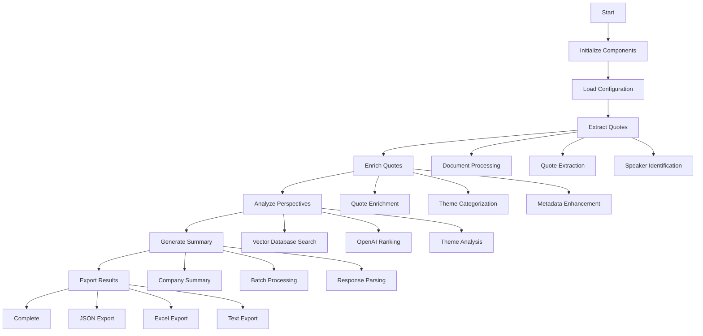
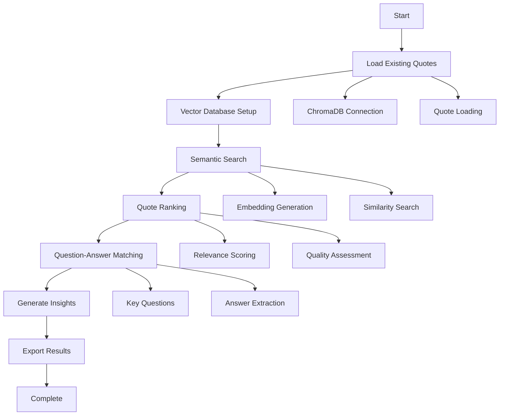
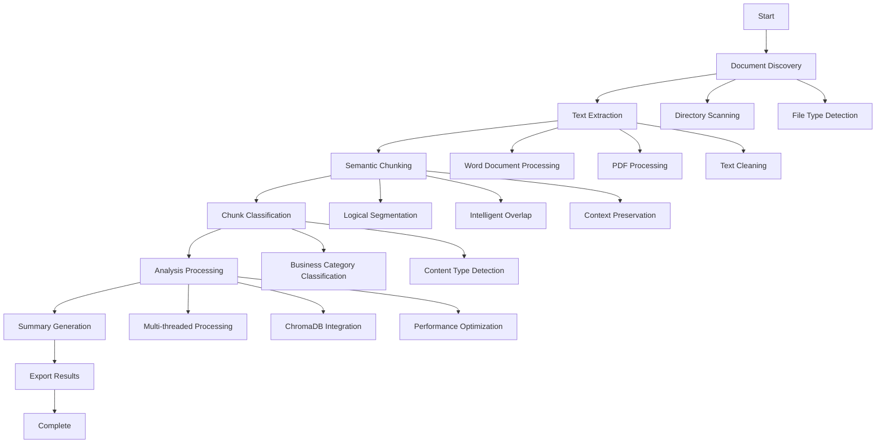

# FlexXray Transcript Summarizer - Workflow Manifest

## 📋 Overview

This document provides a comprehensive overview of all workflows, processes, and execution paths in the FlexXray Transcript Summarizer system. It serves as a reference for understanding how different components interact and how to execute various analysis workflows.

## 🚀 Entry Points and Execution Methods

### **1. Command Line Interface (CLI)**
```bash
# Main analysis tool
python quote_analysis_tool.py --directory "./FlexXray Transcripts"

# Streamlined analysis
python run_streamlined_analysis.py

# GUI application
python transcript_gui.py
```

### **2. Graphical User Interface (GUI)**
```bash
python transcript_gui.py
```
- **Features**: Interactive GUI with progress tracking, directory selection, and real-time monitoring
- **Components**: Tkinter-based interface with analysis options and log viewing

### **3. Programmatic API**
```python
from workflow_manager import WorkflowManager
from streamlined_quote_analysis import StreamlinedQuoteAnalysis
from transcript_grid import TranscriptSummarizer
```

## 🔄 Core Workflow Pipelines

### **Pipeline 1: Complete Quote Analysis Workflow**

**Entry Point**: `quote_analysis_tool.py`
**Orchestrator**: `WorkflowManager`



**Stages**:
1. **Extraction** (`PipelineStage.EXTRACTION`)
   - Document processing and text extraction
   - Quote identification and speaker role detection
   - Vector database storage

2. **Enrichment** (`PipelineStage.ENRICHMENT`)
   - Quote metadata enhancement
   - Theme categorization
   - Date and context information

3. **Analysis** (`PipelineStage.ANALYSIS`)
   - Perspective-based analysis
   - OpenAI-powered ranking
   - Theme identification and correlation

4. **Export** (`PipelineStage.EXPORT`)
   - Multi-format export generation
   - Company summary creation
   - Results validation

### **Pipeline 2: Streamlined Analysis Workflow**

**Entry Point**: `run_streamlined_analysis.py`
**Orchestrator**: `StreamlinedQuoteAnalysis`



**Key Features**:
- Optimized for efficiency with vector database integration
- Focus on question-answer matching
- Streamlined AI calls for better performance

### **Pipeline 3: Transcript Grid Processing**

**Entry Point**: `transcript_gui.py` → `TranscriptSummarizer`
**Orchestrator**: `TranscriptSummarizer`



**Key Features**:
- Advanced document processing capabilities
- Multi-threaded analysis
- Intelligent semantic chunking
- Business category classification

## 🏗️ Workflow Components

### **1. Workflow Manager (`workflow_manager.py`)**

**Purpose**: High-level orchestration and pipeline management

**Key Classes**:
- `WorkflowManager`: Main orchestrator
- `WorkflowConfig`: Configuration management
- `WorkflowState`: State tracking
- `WorkflowStatus`: Status enumeration
- `PipelineStage`: Stage enumeration

**Capabilities**:
- Pipeline orchestration (extraction → enrichment → analysis → export)
- Batch scheduling and monitoring
- Error reporting and recovery
- Workflow state management
- Performance tracking and optimization

### **2. Batch Manager (`batch_manager.py`)**

**Purpose**: Batch processing management for OpenAI operations

**Key Classes**:
- `BatchManager`: Batch processing orchestrator
- `BatchConfig`: Batch configuration

**Capabilities**:
- Batch processing configuration and management
- Token handling and retry mechanisms
- Performance tracking and statistics
- Error handling and recovery
- Rate limiting and optimization

### **3. Document Processor (`document_processor.py`)**

**Purpose**: Document reading and processing for different formats

**Supported Formats**:
- Word documents (.docx)
- PDF files (.pdf)
- Text files (.txt)

**Capabilities**:
- Multi-format document support
- Text extraction and formatting
- Document validation and error handling
- Dependency checking and graceful degradation

### **4. Vector Database Manager (`vector_database.py`)**

**Purpose**: Vector database operations and semantic search

**Capabilities**:
- ChromaDB client initialization and management
- Quote storage with OpenAI embeddings
- Semantic search functionality with metadata filtering
- Speaker role filtering and search optimization
- Database statistics and health monitoring

## 📊 Workflow Configuration

### **Workflow Configuration Options**

```python
@dataclass
class WorkflowConfig:
    max_quotes_for_analysis: int = 50
    max_tokens_per_quote: int = 200
    enable_token_logging: bool = True
    enable_batch_processing: bool = True
    batch_size: int = 20
    batch_delay: float = 1.5
    max_retries: int = 3
    timeout_minutes: int = 60
    enable_monitoring: bool = True
    log_workflow_progress: bool = True
```

### **Batch Configuration Options**

```python
@dataclass
class BatchConfig:
    batch_size: int = 20
    batch_delay: float = 1.5
    failure_delay: float = 3.0
    max_retries: int = 3
    enable_batch_processing: bool = True
    max_quotes_per_perspective: int = 200
```

## 🔧 Workflow Execution Patterns

### **Pattern 1: Full Analysis Workflow**

```python
from workflow_manager import WorkflowManager, WorkflowConfig

# Initialize workflow manager
config = WorkflowConfig(
    max_quotes_for_analysis=100,
    enable_batch_processing=True,
    batch_size=25
)

workflow = WorkflowManager(api_key="your_key", config=config)

# Execute complete workflow
result = workflow.execute_complete_workflow(
    transcript_directory="./FlexXray Transcripts",
    output_directory="./Outputs"
)
```

### **Pattern 2: Streamlined Analysis**

```python
from streamlined_quote_analysis import StreamlinedQuoteAnalysis

# Initialize streamlined analyzer
analyzer = StreamlinedQuoteAnalysis(api_key="your_key")

# Execute streamlined analysis
result = analyzer.analyze_transcripts(
    transcript_directory="./FlexXray Transcripts"
)
```

### **Pattern 3: Individual Component Usage**

```python
# Vector database operations
from vector_database import VectorDatabaseManager
db_manager = VectorDatabaseManager()
quotes = db_manager.semantic_search_quotes("market position")

# Quote processing
from quote_processing import QuoteProcessor
processor = QuoteProcessor()
enriched_quotes = processor.enrich_quotes_for_export(quotes)

# Perspective analysis
from perspective_analysis import PerspectiveAnalyzer
analyzer = PerspectiveAnalyzer(openai_client)
themes = analyzer.analyze_perspective_with_quotes(...)
```

### **Pattern 4: Batch Processing**

```python
from batch_manager import BatchManager, BatchConfig

# Configure batch processing
config = BatchConfig(
    batch_size=30,
    batch_delay=2.0,
    max_retries=5
)

batch_manager = BatchManager(config)

# Process items in batches
results = batch_manager.process_in_batches(
    items=quotes,
    process_function=process_quotes_function,
    context={"perspective": "market_leadership"}
)
```

## 📈 Workflow Monitoring and Status

### **Workflow Status Tracking**

```python
class WorkflowStatus(Enum):
    PENDING = "pending"
    RUNNING = "running"
    COMPLETED = "completed"
    FAILED = "failed"
    CANCELLED = "cancelled"
```

### **Pipeline Stage Tracking**

```python
class PipelineStage(Enum):
    EXTRACTION = "extraction"
    ENRICHMENT = "enrichment"
    ANALYSIS = "analysis"
    EXPORT = "export"
```

### **Workflow State Management**

```python
@dataclass
class WorkflowState:
    status: WorkflowStatus = WorkflowStatus.PENDING
    current_stage: Optional[PipelineStage] = None
    start_time: Optional[datetime] = None
    end_time: Optional[datetime] = None
    progress: float = 0.0
    current_operation: str = ""
    error_message: Optional[str] = None
    retry_count: int = 0
    stage_results: Dict[str, Any] = field(default_factory=dict)
    metadata: Dict[str, Any] = field(default_factory=dict)
```

## 🚨 Error Handling and Recovery

### **Error Handling Strategies**

1. **Retry Mechanisms**: Automatic retry with exponential backoff
2. **Fallback Processing**: Alternative processing methods when primary fails
3. **Graceful Degradation**: Continue processing with reduced functionality
4. **Error Reporting**: Comprehensive error logging and reporting
5. **Recovery Points**: Checkpoint-based recovery for long-running workflows

### **Common Error Scenarios**

1. **OpenAI API Errors**: Rate limiting, token limits, API failures
2. **File Processing Errors**: Corrupted documents, unsupported formats
3. **Vector Database Errors**: Connection issues, storage failures
4. **Configuration Errors**: Missing settings, invalid parameters
5. **Memory Issues**: Large document processing, batch size optimization

## 🔄 Workflow Optimization

### **Performance Optimization Strategies**

1. **Batch Processing**: Process multiple items together to reduce API calls
2. **Parallel Processing**: Multi-threaded execution for independent operations
3. **Caching**: Store intermediate results to avoid reprocessing
4. **Token Management**: Optimize token usage and batch sizes
5. **Resource Management**: Monitor and optimize memory and CPU usage

### **Scalability Considerations**

1. **Horizontal Scaling**: Multiple worker processes for large datasets
2. **Vertical Scaling**: Optimize batch sizes and processing parameters
3. **Resource Monitoring**: Track performance metrics and bottlenecks
4. **Load Balancing**: Distribute processing across multiple instances
5. **Queue Management**: Implement job queues for large-scale processing

## 📋 Workflow Checklist

### **Pre-Execution Checklist**

- [ ] OpenAI API key configured
- [ ] Transcript directory exists and accessible
- [ ] Output directory exists and writable
- [ ] Required dependencies installed
- [ ] Configuration validated
- [ ] Vector database initialized (if using)

### **Execution Monitoring**

- [ ] Workflow status tracking enabled
- [ ] Progress monitoring active
- [ ] Error logging configured
- [ ] Performance metrics collection
- [ ] Resource usage monitoring

### **Post-Execution Validation**

- [ ] Output files generated successfully
- [ ] Results validated for completeness
- [ ] Error logs reviewed
- [ ] Performance metrics analyzed
- [ ] Resource cleanup completed

## 🔮 Future Workflow Enhancements

### **Planned Improvements**

1. **Web Interface**: Browser-based workflow management
2. **API Endpoints**: RESTful API for workflow execution
3. **Real-time Monitoring**: Live workflow status and progress tracking
4. **Workflow Templates**: Pre-configured workflow templates for common use cases
5. **Advanced Scheduling**: Cron-based scheduling and automation

### **Integration Opportunities**

1. **Cloud Deployment**: Scalable cloud-based workflow execution
2. **Database Integration**: Persistent workflow state and results storage
3. **Notification Systems**: Email/Slack notifications for workflow completion
4. **Third-party Integrations**: CRM, document management system integration
5. **Advanced Analytics**: Workflow performance analytics and optimization

## 📚 Workflow Documentation

### **Related Documentation**

- `MODULAR_STRUCTURE_README.md`: Module architecture overview
- `UNIFIED_CONFIGURATION_README.md`: Configuration system documentation
- `BATCH_PROCESSING_README.md`: Batch processing implementation details
- `WORKFLOW_ORCHESTRATION_REFACTORING.md`: Workflow refactoring notes

### **API Reference**

- `workflow_manager.py`: Workflow orchestration API
- `batch_manager.py`: Batch processing API
- `streamlined_quote_analysis.py`: Streamlined analysis API
- `transcript_grid.py`: Transcript processing API

---

*This workflow manifest provides a comprehensive guide to understanding and executing workflows in the FlexXray Transcript Summarizer system. For specific implementation details, refer to the individual module documentation and API references.*
