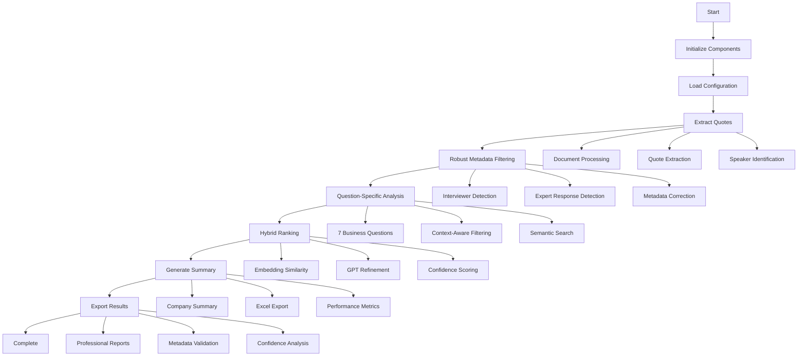
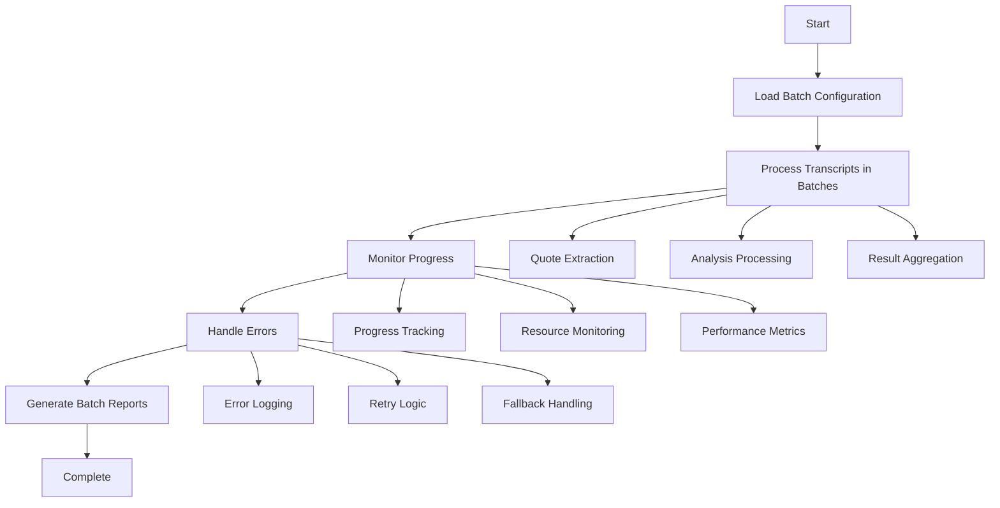
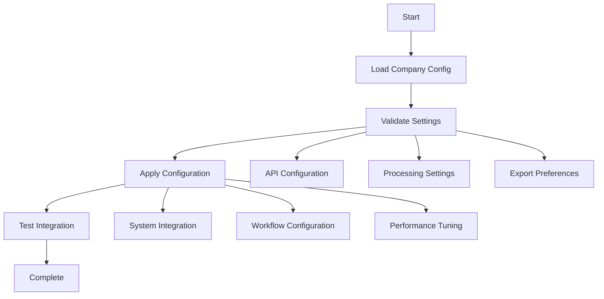
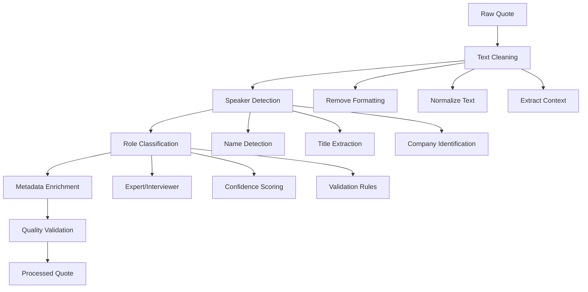
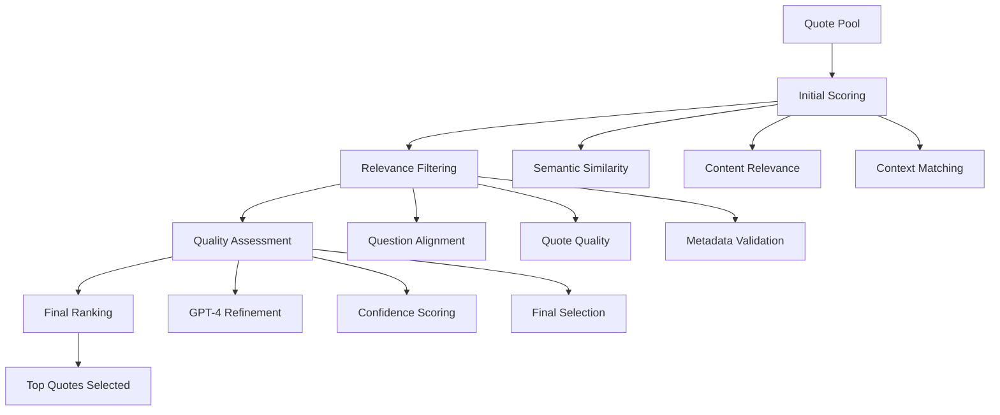
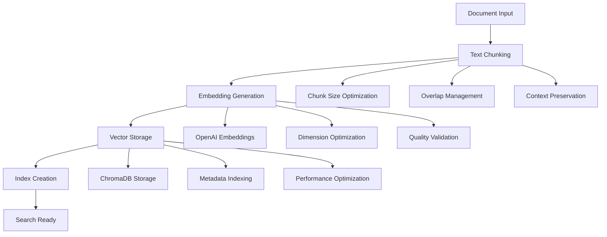

# FlexXray Transcript Summarizer - Workflow Manifest

## 📋 Overview

This document provides a comprehensive overview of all current workflows, processes, and execution paths in the FlexXray Transcript Summarizer system. It serves as a reference for understanding how different components interact and how to execute various analysis workflows.

## 🚀 Entry Points and Execution Methods

### **1. Command Line Interface (CLI)**
```bash
# 🚀 RECOMMENDED: Streamlined analysis (Production use)
python run_streamlined_analysis.py

# GUI application
python transcript_gui.py
```

### **2. Graphical User Interface (GUI)**
```bash
python transcript_gui.py
```
- **Features**: Interactive GUI with progress tracking, directory selection, and real-time monitoring
- **Components**: Tkinter-based interface with analysis options and log viewing

### **3. Programmatic API**
```python
from streamlined_quote_analysis import StreamlinedQuoteAnalysis
from workflow_manager import WorkflowManager
from transcript_grid import TranscriptSummarizer
```

## 🔄 Core Workflow Pipelines

### **Pipeline 1: Streamlined Analysis Workflow (CURRENT)**

**Entry Point**: `run_streamlined_analysis.py`
**Orchestrator**: `StreamlinedQuoteAnalysis`



**Stages**:
1. **Extraction** (`PipelineStage.EXTRACTION`)
   - Document processing and text extraction
   - Quote identification and speaker role detection
   - Vector database storage

2. **Metadata Filtering** (`PipelineStage.ENRICHMENT`)
   - Robust interviewer question detection
   - Expert response identification
   - Automatic metadata correction

3. **Analysis** (`PipelineStage.ANALYSIS`)
   - 7 specific business questions
   - Context-aware quote filtering
   - Semantic search and retrieval

4. **Export** (`PipelineStage.EXPORT`)
   - Professional Excel reports
   - Company summary creation
   - Confidence analysis and validation

### **Pipeline 2: Batch Processing Workflow**

**Entry Point**: `batch_manager.py`
**Orchestrator**: `BatchManager`



**Features**:
- Configurable batch sizes
- Progress monitoring and reporting
- Error handling and recovery
- Resource optimization

### **Pipeline 3: Company Configuration Workflow**

**Entry Point**: `company_config.py`
**Orchestrator**: `CompanyConfigManager`



**Features**:
- Company-specific settings
- Configuration validation
- Integration testing
- Performance optimization

## 🧩 Component Workflows

### **Quote Processing Workflow**

**Component**: `quote_processing.py`
**Purpose**: Core quote processing and enrichment



### **Quote Ranking Workflow**

**Component**: `quote_ranking.py`
**Purpose**: Intelligent quote ranking and selection



### **Vector Database Workflow**

**Component**: `vector_database.py`
**Purpose**: Semantic search and storage



## 🔧 Configuration Workflows

### **Environment Configuration**

**File**: `.env`
**Purpose**: System-wide configuration

```bash
# Required Configuration
OPENAI_API_KEY=your_api_key_here

# Optional Configuration
CACHE_DIR=cache
BATCH_SIZE=20
MAX_QUOTES=50
CONFIDENCE_THRESHOLD=2
LOG_LEVEL=INFO
```

### **Company Configuration**

**File**: `company_config.py`
**Purpose**: Company-specific settings

```python
# Company Configuration Example
company_config = {
    "company_name": "FlexXray",
    "analysis_questions": [
        "market_leadership",
        "value_proposition",
        "local_presence"
    ],
    "export_format": "excel",
    "batch_processing": True,
    "metadata_validation": True
}
```

### **Prompt Configuration**

**File**: `prompt_config.py`
**Purpose**: AI prompt management

```python
# Prompt Configuration Example
prompts = {
    "market_leadership": "What evidence shows {company}'s market leadership?",
    "value_proposition": "How does {company}'s value proposition address risks?",
    "local_presence": "How does {company}'s local presence drive demand?"
}
```

## 📊 Monitoring and Reporting

### **Progress Tracking**

**Component**: `workflow_manager.py`
**Features**:
- Real-time progress updates
- Stage completion tracking
- Performance metrics
- Error reporting

### **Logging and Debugging**

**Component**: `logging_config.py`
**Features**:
- Configurable log levels
- Structured logging
- Performance profiling
- Error tracking

### **Performance Metrics**

**Metrics Tracked**:
- Processing time per stage
- API call costs
- Quote quality scores
- System resource usage

## 🚨 Error Handling and Recovery

### **Error Types and Handling**

1. **API Errors**
   - Rate limiting
   - Authentication failures
   - Service unavailability

2. **Processing Errors**
   - File corruption
   - Memory issues
   - Timeout handling

3. **Recovery Strategies**
   - Automatic retries
   - Fallback mechanisms
   - Graceful degradation

### **Fallback Mechanisms**

- **Model Fallbacks**: GPT-4 → GPT-4o-mini → GPT-3.5-turbo
- **Processing Fallbacks**: Full analysis → Simplified analysis → Basic extraction
- **Export Fallbacks**: Excel → CSV → Text

## 🔄 Integration Points

### **External Systems**

- **OpenAI API**: Quote analysis and ranking
- **ChromaDB**: Vector storage and search
- **File Systems**: Document input and output
- **Excel**: Report generation and export

### **Internal Components**

- **Quote Analysis Core**: Central analysis engine
- **Metadata Filtering**: Speaker role detection
- **Ranking System**: Quote selection algorithms
- **Export Utilities**: Report generation

## 📈 Performance Optimization

### **Optimization Strategies**

1. **Batch Processing**: Process multiple items together
2. **Caching**: Store intermediate results
3. **Model Selection**: Use appropriate models for each task
4. **Parallel Processing**: Concurrent execution where possible

### **Resource Management**

- **Memory**: Efficient data structures and cleanup
- **API Calls**: Rate limiting and optimization
- **Storage**: Compressed storage and cleanup
- **CPU**: Task prioritization and scheduling

## 🧪 Testing and Validation

### **Test Workflows**

```bash
# Run all tests
python run_tests.py

# Test specific components
python -m pytest tests/test_streamlined_system.py -v
python -m pytest tests/test_robust_metadata_filtering.py -v
python -m pytest tests/test_quote_ranking.py -v
```

### **Validation Workflows**

1. **Quote Quality Validation**
   - Relevance scoring
   - Metadata accuracy
   - Content completeness

2. **System Performance Validation**
   - Processing speed
   - Resource usage
   - Error rates

3. **Output Quality Validation**
   - Report completeness
   - Data accuracy
   - Format consistency

## 📚 Documentation and Support

### **Documentation Structure**

- **README.md**: Main project overview
- **STREAMLINED_ANALYSIS_README.md**: Current system details
- **COMPANY_CONFIGURATION_README.md**: Configuration guide
- **BATCH_PROCESSING_README.md**: Batch processing guide
- **RAG_FUNCTIONALITY_README.md**: Vector database guide

### **Support Resources**

1. **Logs**: `flexxray.log` for detailed execution information
2. **Configuration**: Environment and company-specific settings
3. **Testing**: Comprehensive test suite for validation
4. **Documentation**: Detailed guides for each component

---

**This workflow manifest covers all current and active workflows in the FlexXray Transcript Summarizer system.**
